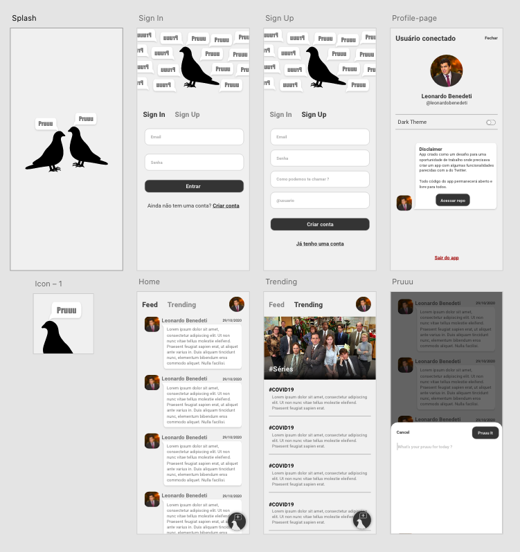

# Pruuu App
App criado como um desafio técnico para uma oportunidade. 

### Contexto do desafio: 

Criar um microblog onde você tenha uma mecanica parecida com a do Twitter mas com uma nova identidade e é claro, feito em Flutter.

### Contexto do que foi prototipado: 

Antes das redes sociais, para você saber das novidades e comentar as suas próprias, tudo era falado pessoalmente e o lugar mais adequado para esse tipo de interação eram as praças. 

Dai pra remeter algo sobre isso, pensei numa identidade toda voltada para o bicho mais populoso das praças, sim, o POMBO. rsrsrs

Com isso criei uma interface simples, com apenas duas cores e com ícones de pombos para cada ação. 

### Etapas do desafio:
- [x] Criar uma ideia para abranger o contexto ( não precisava no desafio, mas prefiro seguir um protótipo do que ir fazendo sem rumo )
- [x] Splash Screen
- [x] Feed Screen dos últimos Pruuus
- [x] Trending Screen
- [x] Pruuu It Widget
- [x] Sign out Widget(user já logado)
- [ ] Sign in Widget / Sign up Widget
- [ ] Validações de inputs
- [ ] Error Widget
- [ ] Inclusão de arquitetura e gerência de estado
- [ ] Ajeitar comportamentos de componentes funcionando

### Protótipo criado

